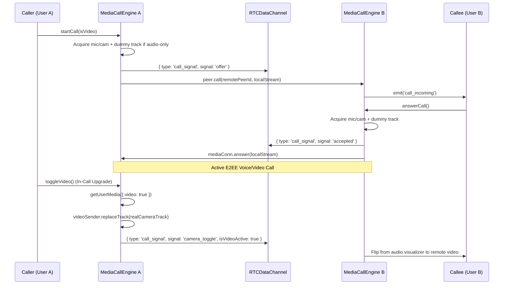

# ZeroChat: Agent Architecture Index & Wire Protocol Reference

> **Purpose**: This document serves as the high-speed architectural index for AI agents and developers working on ZeroChat. It outlines system boundaries, component directories, exact P2P WebRTC packet formats, and step-by-step feature addition patterns.

---

## 1. ZeroChat Architecture Principles

1. **Pure P2P Zero-Database WebRTC**: No database, no backend logging, no message persistence. PeerJS connects directly via standard WebRTC `RTCDataChannel` and `MediaConnection`.
2. **Strict 1-on-1 Rooms**: Each room accepts exactly two peers. A 3rd connecting browser is rejected with a `room_occupied` packet and blocked from looping.
3. **Memory-to-Memory AirDrop Streaming**: Files are chunked into 16KB `ArrayBuffer` slices, streamed with backpressure monitoring (`bufferedAmount > 64KB`), reassembled into in-memory `Blob` objects, and cleaned up when burned.
4. **Resilient Media Calling**: Audio and video calls use a silent dummy canvas video track on audio calls to pre-establish the `m=video` pipeline, enabling seamless mid-call camera upgrades without SDP renegotiation dropouts.

---

## 2. Directory & Module Index

```
src/
├── services/
│   ├── peerService.js                     # Unified Facade singleton (PeerJS lifecycle, heartbeat, reconnect loop)
│   └── webrtc/
│       ├── constants.js                   # ICE_SERVERS, CHUNK_SIZE (16KB), ROOM_WORDS, generateRoomId()
│       ├── fileStreamEngine.js            # 16KB ArrayBuffer streaming, assembler, progress & cancellation
│       └── mediaCallEngine.js             # Voice/video calling, dummy track, camera upgrade, screen sharing
├── components/
│   ├── ChatArea.jsx                       # Main chat orchestrator (drag-drop, typing debounce, auto-scroll)
│   ├── chat/
│   │   ├── ChatHeader.jsx                 # Remote peer status, E2EE badge, call trigger buttons
│   │   ├── RoomHeroCard.jsx               # QR code, 3-word code box, copy link, quick guide
│   │   ├── MessageItem.jsx                # Single message row, code block, image preview, delivery status
│   │   ├── ReplyQuoteBox.jsx              # In-bubble quoted card with click-to-scroll trigger
│   │   ├── ReplyPreviewDock.jsx           # Floating active reply dock above input
│   │   └── ChatInputBar.jsx               # Text input, voice recorder, emoji picker, send button
│   ├── FileTransferArea.jsx               # Drag-and-drop file drop zone & transfer progress list
│   ├── CallModal.jsx                      # Active audio/video call UI, visualizer & floating pill dock
│   ├── RoomModal.jsx                      # Join room by 3-word code or share invite link
│   ├── InfoModal.jsx                      # 30-second quick start guide & security explanation
│   ├── NicknameModal.jsx                  # Custom nickname modal
│   ├── ImageLightboxModal.jsx             # Full-screen image zoom viewer
│   ├── AudioPlayerBubble.jsx              # Custom animated audio waveform player
│   └── Header.jsx                         # App top bar, ping latency monitor, room burn button
├── styles/
│   ├── variables.css                      # Design tokens (colors, gradients, radii, glass-blur)
│   ├── base.css                           # Reset, ambient background, scrollbars, toasts, buttons
│   ├── layout.css                         # App shell, workspace grid, file sidebar
│   ├── chat.css                           # Message list, bubbles, threaded quotes, reply dock, typing dots
│   ├── media.css                          # Audio bubbles, code blocks, drag overlay, inputs, emojis
│   ├── call.css                           # Floating pill controls dock, video viewports, audio visualizer, PIP
│   ├── modals.css                         # Modal overlays, room code display, guide steps
│   └── responsive.css                     # Tablet (769-1024px) & Mobile (<=768px) layout rules
├── index.css                              # Master stylesheet barrel importing styles/*.css
├── utils/
│   ├── clipboard.js                       # Universal clipboard copying with LAN IP fallback
│   ├── crypto.js                          # Cryptographic room ID generation & hashing
│   ├── soundEffects.js                    # Web Audio API procedural sound synthesis (0 audio files)
│   └── voiceRecorder.js                   # MediaRecorder audio capture with iOS Safari webm/mp4 fallback
└── App.jsx                                # Root application state & modal coordinator
```

---

## 3. P2P WebRTC Wire Protocol (DataChannel Packets)

All structured communication across the WebRTC `RTCDataChannel` uses JSON packets. Binary file chunks are transmitted as raw `ArrayBuffer` instances preceded by metadata headers.

### 3.1 Packet Types & Schemas

| Type | Payload Schema | Description |
|---|---|---|
| `handshake` | `{ type: 'handshake', nickname, peerId }` | Sent immediately upon DataChannel opening. |
| `handshake_ack` | `{ type: 'handshake_ack', nickname, peerId }` | Response to handshake with local nickname. |
| `text` | `{ type: 'text', id, text, senderNickname, timestamp, replyTo? }` | Text message. Optional `replyTo: { id, senderNickname, snippet, type }`. |
| `ack` | `{ type: 'ack', id }` | Delivery receipt sent upon receiving a text message. |
| `typing` | `{ type: 'typing', isTyping: boolean, nickname }` | Remote typing indicator state. |
| `ping` | `{ type: 'ping', sendTime: number }` | Heartbeat probe sent every 3 seconds. |
| `pong` | `{ type: 'pong', sendTime: number }` | Heartbeat response used to calculate round-trip latency. |
| `nickname_update` | `{ type: 'nickname_update', nickname }` | Emitted when user updates their display name. |
| `room_occupied` | `{ type: 'room_occupied', reason }` | Sent by host to reject a 3rd peer from a full room. |
| `disconnect` | `{ type: 'disconnect' }` | Sent when user explicitly clicks "Burn Chat" or closes session. |
| `file_meta` | `{ type: 'file_meta', fileId, fileName, fileSize, fileType, totalChunks, isVoiceNote, durationSec }` | Header initiating file transfer. |
| `file_chunk_meta`| `{ type: 'file_chunk_meta', fileId, chunkIndex }` | Precedes each raw binary `ArrayBuffer` chunk. |
| `file_cancel` | `{ type: 'file_cancel', fileId }` | Bi-directional file transfer cancellation. |
| `call_signal` | `{ type: 'call_signal', signal: 'offer'\|'accepted'\|'rejected'\|'busy'\|'ended'\|'camera_toggle', isVideo?, isVideoActive? }` | In-call signaling & camera state synchronization. |

---

## 4. WebRTC Calling Engine Lifecycle



---

## 5. Cheat Sheet: Common Extension Patterns

### 5.1 Adding a New Message Action / Type
1. **Define Type**: If sending a new packet type, add handling to [`src/services/peerService.js`](file:///d:/sanjay/antigravity%20projects/project-fun/src/services/peerService.js#L380) under `handleIncomingPacket`.
2. **Emit Event**: Use `this.emit('my_new_event', data)`.
3. **Handle in App.jsx**: Listen in `useEffect` via `peerService.on('my_new_event', handleEvent)`.
4. **Render in MessageItem**: Add rendering logic in [`src/components/chat/MessageItem.jsx`](file:///d:/sanjay/antigravity%20projects/project-fun/src/components/chat/MessageItem.jsx).

### 5.2 Modifying Styles
- Look up the targeted module in `src/styles/`:
  - Bubble or message styles -> [`src/styles/chat.css`](file:///d:/sanjay/antigravity%20projects/project-fun/src/styles/chat.css)
  - Video or call dock -> [`src/styles/call.css`](file:///d:/sanjay/antigravity%20projects/project-fun/src/styles/call.css)
  - Modal or guide -> [`src/styles/modals.css`](file:///d:/sanjay/antigravity%20projects/project-fun/src/styles/modals.css)
  - Mobile layout -> [`src/styles/responsive.css`](file:///d:/sanjay/antigravity%20projects/project-fun/src/styles/responsive.css)
- **Do not edit `src/index.css` directly**; it is reserved as the CSS import barrel.
